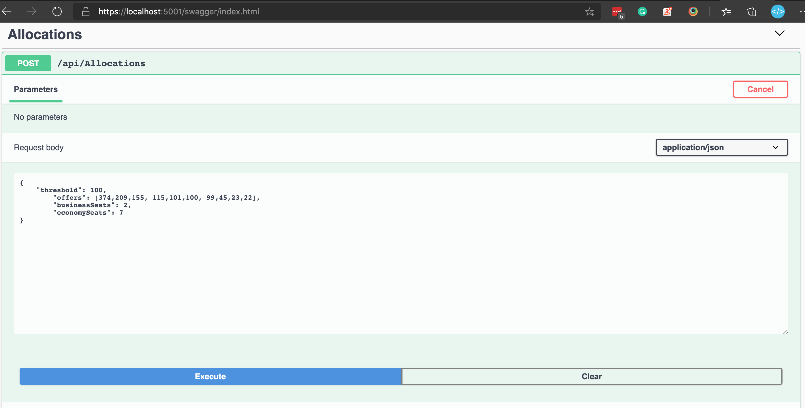
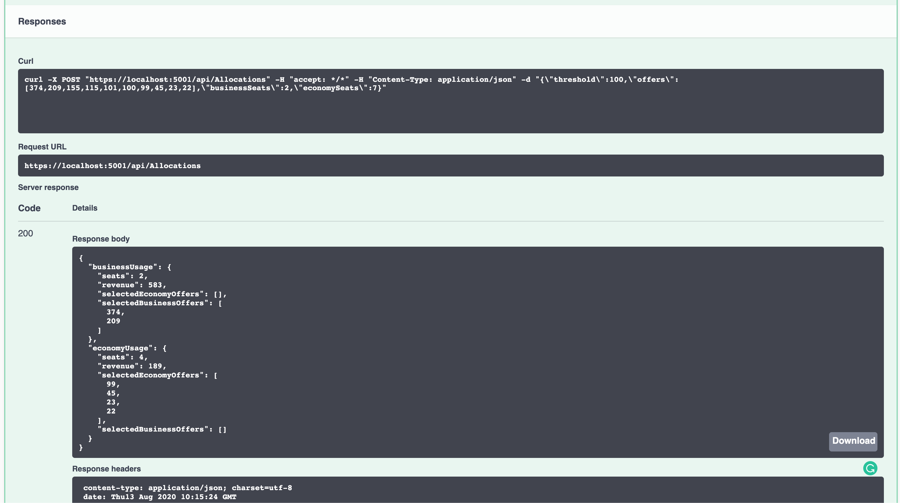
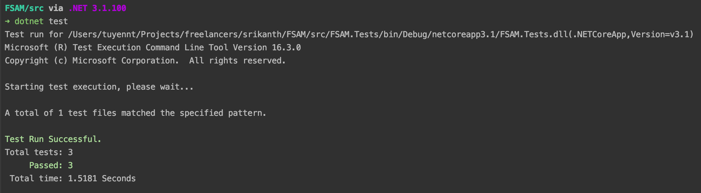

# FSAM: Flight Seat Allocation Manager API

##  How to run the project?
At `src` folder, run
```shell
dotnet run --project FSAM.Api
```
[](./how-to-run.png)

Goto `https://localhost:5001/swagger/index.html` and make a test request




Or run the following command
```shell
curl -X POST "https://localhost:5001/api/Allocations" -H "accept: */*" -H "Content-Type: application/json" -d "{\"threshold\":100,\"offers\":[374,209,155,115,101,100,99,45,23,22],\"businessSeats\":2,\"economySeats\":7}"
```
we will receive this response
```js
{
    "businessUsage": {
        "seats": 3,
        "revenue": 738,
        "selectedEconomyOffers": [],
        "selectedBusinessOffers": [
            374,
            209,
            155
        ]
    },
    "economyUsage": {
        "seats": 3,
        "revenue": 167,
        "selectedEconomyOffers": [
            99,
            45,
            23
        ],
        "selectedBusinessOffers": []
    }
}
```

## How to run the unit tests?
At src folder, run
``` shell
dotnet test
```
